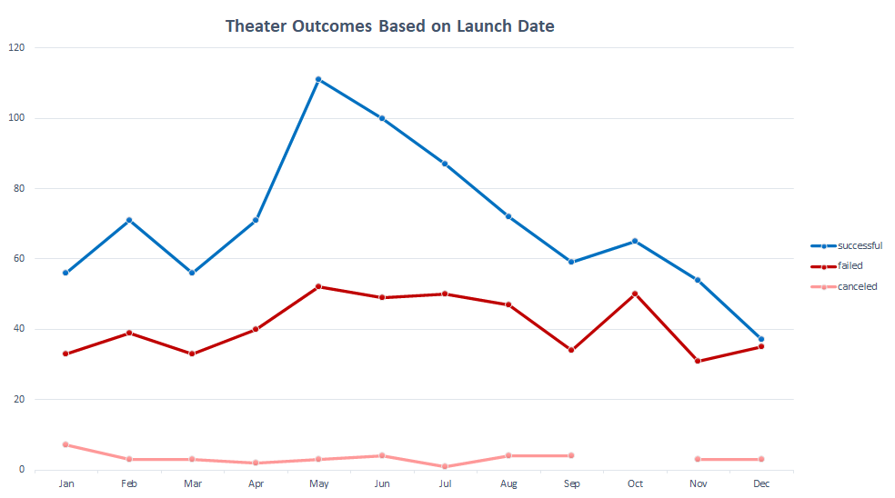
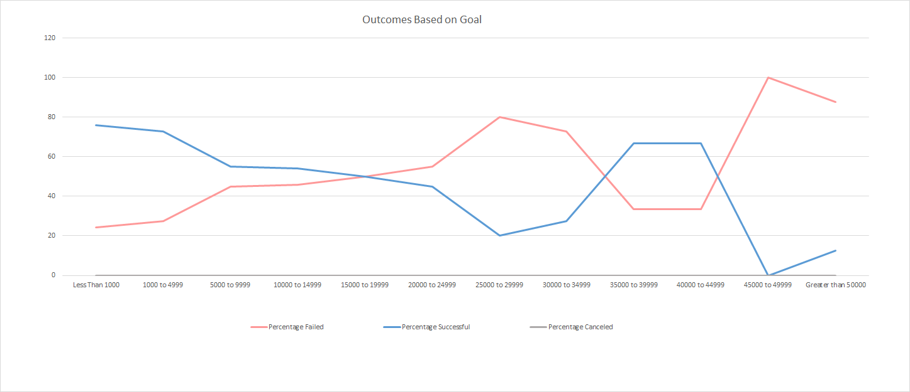

# **Analysis of Kickstarter Campaign Data**

  

## **Overview of Project**

### Kickstarter Analysis for Louise's Theater Project.

This project further explores data taken from kickstarter.  It is an attempt to explore possible relationships between  theater campaigns 'launch date' and 'goal amount' with their outcomes (success/failiure). These trends may lead us to a better understanding of when it is best to Launch a campaign and how high our goal should be. It will visualize these relationships with line charts.

[Kickstarter Data](Kickstarter_Challenge.xlsx)

## **Analysis and Challenges**

### Analysis of Outcomes Based on Launch Date
From the data provided, we first created a new column "Years" allowing our data to be filterd by year of Launch date. We are then able to use a pivot table to compare outcomes of campaigns,(success, failiure, cancellation) to launch dates by month, with the further option to look at each year individually. We have filtered the data by catergory to look specifically at Theater campaigns.
The relationship between outcome and Launch date is visualized in the line chart below.

[Outcomes_Based_on_Launch](Resources/Theater_Outcomes_vs_Launch.png)

 

### Analysis of Outcomes Based on Goals
In order to examine the relationship between goals and outcome, we have created a table with 12 new catergories for goal amount ranges. Then, looking at the subcategory "plays", found the count of success, failiure and cancelled outcomes for each of these new goal ranges.  We have used these counts to calculated the percentages of Success and Failiure for each of our new Goal range catergories. 
The results are visualized in the line chart below.

[Outcomes_Based_on_Goals](Resources/Outcomes_vs_Goals.png)

 

### Challenges and Difficulties Encountered
Working in Excel it is easy to accidently make an error in a cell. In order to help spot these errors we can cross check totals. For the 'outcome' totals at the bottom of my 'Outcomes by Goal table' I calculated using =sum(column) and crosschecked in the cell below using a countifs for all occurences of the desired 'outcome' with a Goal >0. This helped highlight any errors in Outcome columns cell.    

## **Conclusions**
### Outcomes based on Launch Date

- At a glance we can see that May is the best time to launch. Campaigns launched in at the beginning of summer have the highest sucess rate with May being the peak with 111 success' to 52 failiure.  
- December is the worst time to launch.  We can see that theater kickstarters launched in December are the least successful, 37 success' to 35 failiures. Perhaps, donors have too many other expenses around the holiday period.

 
### Outcomes Based on Goals
- More modest play based kickstarters are the most successful and most common. Percentage success rate is highest for campaigns of less than $1000 and remains high for campaigns under $5000. 
 - Goals set at $45,000 and above are least successful and success rate remains poor for higher goals. Higher goals are also far less common.  It may be that the backers can not accept a cost this high for crowd funded drama. 
  
  
  

### Dataset Limitations

- Lacking data. The lack of campaigns with high goals limits this dataset. We have only one campaign in the $45-50k, three in $40-45k. Most Play kickstarters set a goal of less than $10k.
- We can see when filtering by years that although we have kickstarter data dating back to 2009, most of the theater campaigns are from 2014 through 2016. Adding more years will improve data quality.  

### Possible Further visualizations 
 - A box and whisker graph could be created to show us the amounts requested for campaigns, allowing us to see the median, IQR and spot outliers.

 - Further breakdown of goal catergories to focus on the lower end goal.
  - We can calculate length of campaign form the start and end datess. Then look for effects of campaign length on outcome.
  - We can look at the effect of being a "staff pick" on outcomes. 

